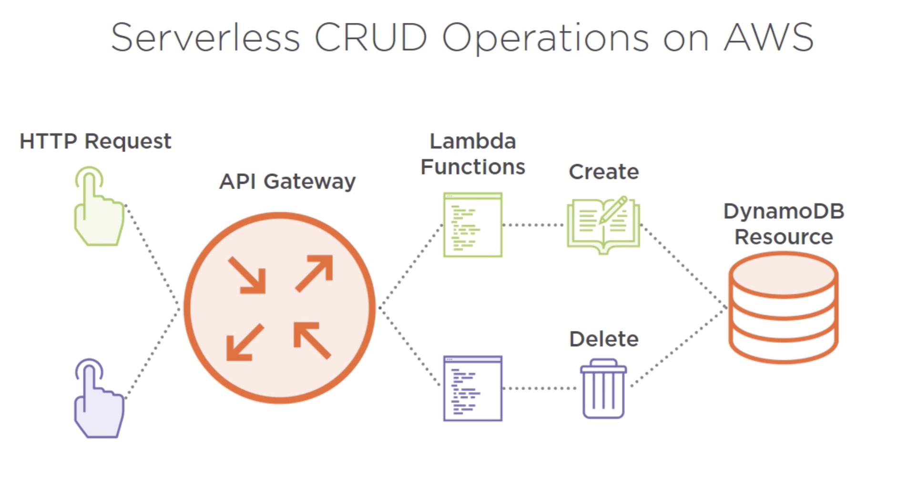

# serverless-nodejs-aws-demo

### Pre-requisites:

- NodeJs
- Serverless Framework CLI
- AWS CLI
- Active AWS account with ApiGateway and Dynamo db access

```
$node -v

Install serverless framework:
$npm install serverless -g 

$serverless -v  (or) sls -v

$aws --version

$aws configure 
AWS Access Key ID [None]: <<Input here>>
AWS Secret Access Key [None]: <<Input here>>
Default region name [None]:
Default output format [None]:

```

##### `AWS IAM and Policies`::

Please follow these steps while creating the AWS IAM User.

- Go to the Users section under Identity and Access Management (IAM) services in AWS management console.
- Click Add User 
- Enter a valid user name. Under `Select AWS access type` check the box for `Programmatic access`.  
- Select `Attach existing policies directly` under `Set permissions` on the `Add User` screen.  
- Attach the below listed policies to the IAM User.
- Standard AWS Managed Policies that you need to attach to your user.
```
AmazonDynamoDBFullAccess
AmazonAPIGatewayAdministrator
AWSLambdaFullAccess
```
- Hit `Next:Tags`. Skip to `Next:Review`
- Review the User permissions and policies attached. Hit `Create user`. 
- From the confirmation screen please download and save the `ACCESS_KEY_ID` and `SECRET_ACCESS_KEY` at a secure location.  

To run the project locally, you will need the following secrets from your AWS IAM User.

* `ACCESS_KEY_ID`
* `SECRET_ACCESS_KEY`

#### Using serverless to setup aws credentials on your machine

- Grab the `ACCESS_KEY_ID` and `SECRET_ACCESS_KEY` for the above created IAM User and replace it in the below command respectively.

```
$ node_modules/.bin/serverless config credentials --provider aws --key <ACCESS_KEY_ID> --secret <SECRET_ACCESS_KEY>
```

This will create `~/.aws/credentials` in your computer. `serverless` will use this credentials to deploy to your account

### What is serverless framework??

Serverless framework application model:

- Functions: which executes some code in response to some events.

- Events: Like HttpRequest, a schedule timer event or infrastructure provider event like aws s3 fileupload event

        In AWS, you can trigger functions with the events from API Gateway, s3, CloudWatch, DynamoDb

- Resources: Infrastructure that your application depends on ex: dynamodb table, aws s3 bucket etc.

- Serverless Services: A service is like a project. It's where you define your AWS Lambda functions, the events that trigger them and any AWS Infrastructure resources they require, all in a file called serverless.yml. 
A fullblown application can have many services.

### What is AWS ApiGateway?
Amazon API Gateway is an AWS service for creating, publishing, maintaining, monitoring, and securing REST and WebSocket APIs at any scale. 
### What is AWS Dynamodb?
- Amazon Dynamodb is a fully managed NOSQL database service that provides fast and predictable performance with seamless scalability.

### Architecture:



#### How to run this??

``` 
    git clone git@github.com:srigumm/serverless-nodejs-aws-lambda-demo.git
    cd <<>>
    npm install

    aws config 
    **configure aws access key here

    serverless deploy
```
#### How to test this??
```
Curl -i -H "Content-Type: application/json" -X POST -d '{"flavour":"Strawberry","quantity":22}' https://<<your gateway url>>/dev/api/v1/ecupcakes/order

Curl -i -H "Content-Type: application/json" -X POST -d '{"flavour":"Strawberry","quantity":11}' https://<<your gateway url>>/dev/api/v1/ecupcakes/order

Curl -i -H "Content-Type: application/json" -X GET https://<<your gateway url>>/dev/api/v1/ecupcakes/order

```

#### Cleanup:

```
    serverless remove
```

### 2. Create a sample service (serverless framework service) project from a template

```
serverless create --template aws-nodejs --path <<servicename>>

This should create "serverless.yml" and "handler.js" file in your current directory
```

### 3. Deploy sample service (serverless framework service) 

```
serverless deploy
(or)
serverless deploy function  --function <<functionamehere>>
(or)
serverless deploy --package package-path
```

 


Inspired by - https://github.com/serverless/examples/tree/master/aws-node-rest-api-with-dynamodb


